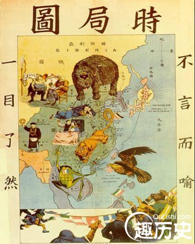

# 八国联军侵华战争

## 事件经过

### 公元1900年5月28日
当时的大英帝国、美利坚合众国、法兰西第三共和国、德意志帝国、俄罗斯帝国、大日本帝国、意大利王国、奥匈帝国为首的八个主要国家组成的对大清帝国的武装侵略战争。

### 1900年5月30日至6月2日
八国的海军陆战队400多人，陆续由天津乘火车开到北京，进驻东交民巷。

### 1900年8月14日
北京城彻底沦陷，八国联军所到之处，杀人放火、奸淫抢掠！从紫禁城、中南海、颐和园中偷窃和抢掠的珍宝更是不计其数！其中著名的万园之园“圆明园”继英法联军之后再遭劫掠，终成废墟。

## 参考资料
- [八国联军侵华战争](https://baike.baidu.com/item/%E5%85%AB%E5%9B%BD%E8%81%94%E5%86%9B%E4%BE%B5%E5%8D%8E%E6%88%98%E4%BA%89/10056574?fr=aladdin) 
- [八国联军](http://www.qulishi.com/huati/baguolianjun/) 

