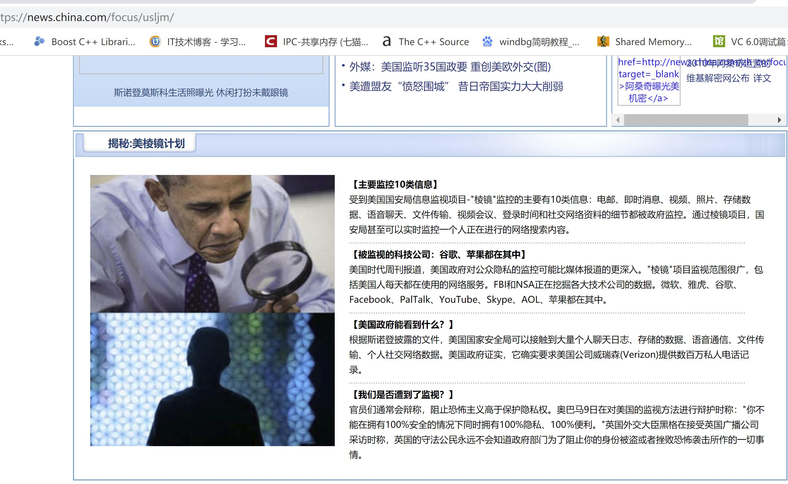
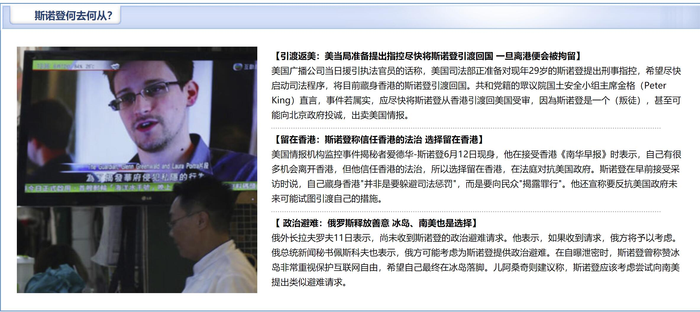

# 棱镜门窃听计划
## 事情经过
### 2007
棱镜计划（PRISM）是一项由美国国家安全局（NSA）自2007年小布什时期起开始实施的绝密电子监听计划，该计划的正式名号为“US-984XN”。
### 2013年6月5日
2013年6月5日，英国《卫报》先扔出了第一颗舆论炸弹：美国国家安全局有一项代号为"棱镜"的秘密项目，要求电信巨头威瑞森公司必须每天上交数百万用户的通话记录。
### 2013年6月6日
6月6日，美国《华盛顿邮报》披露称，过去6年间，美国国家安全局和联邦调查局通过进入微软、谷歌、苹果、雅虎等九大网络巨头的服务器，监控美国公民的电子邮件、聊天记录、视频及照片等秘密资料。
### 2013年6月13日
FBI已经开始对曝光美国国家安全局“棱镜”计划的斯诺登展开刑事调查，实施全球追捕。

  
  
 

## 参考资料
- [棱镜门窃听计划](https://news.china.com/focus/usljm/) 
- [棱镜门](https://baike.baidu.com/item/%E6%A3%B1%E9%95%9C%E9%97%A8/6006333?fr=aladdin) 
- [中国官方表态：“棱镜门”属实，腾讯 QQ 也是 NSA 监听范围](https://www.huxiu.com/article/34886.html) 
