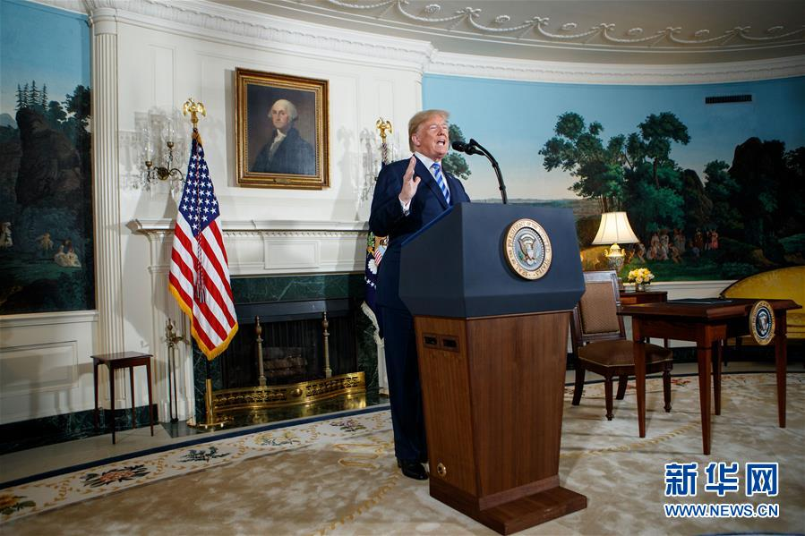

# 特朗普宣布美国退出伊核协议
## 事件经过
### 2018.5.8
美国总统特朗普８日宣布，美国将退出伊核协议，并重启因伊核协议而豁免的对伊朗制裁。

## 相关资料
- [特朗普宣布美国退出伊核协议](http://www.xinhuanet.com/world/2018-05/09/c_1122803379.htm) 
- [美国退出伊核协议](http://d.news.ifeng.com/pc/special/100506/index.shtml) 
- [如何看待美国退出伊核协议?](https://www.zhihu.com/question/276442670) 
- [为何美国都退出伊朗核协议了，伊朗却坚持不退出|军情观察](http://news.jstv.com/a/20190123/5c4825edf3ca624aaaafd7cd.shtml) 

