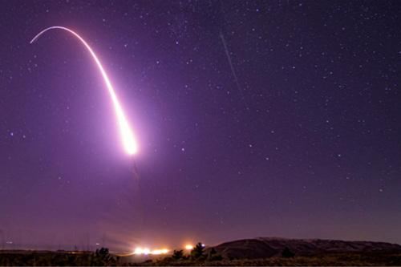

# 美国宣布正式退出《中导条约》
## 事件经过
### 2019.8.2
美国国务卿蓬佩奥当地时间2日发表声明称,由于俄罗斯未能履行条约义务,美国于今日正式退出《中导条约》。
### 2019.8.2
美国8月成功试射一枚路基中程巡航导弹，这标志着美国已经试射了此前《中导条约》所禁止的全部导弹类型。
### 2019.12.12
据美国国防部消息，美国成功试射一枚中程弹道导弹。

## 参考资料
- [美国宣布正式退出《中导条约》](https://baijiahao.baidu.com/s?id=1640802462039285073&wfr=spider&for=pc) 
- [退约后，美军再次试射《中导条约》所禁中程导弹](http://mil.news.sina.com.cn/2019-12-13/doc-iihnzhfz5554202.shtml) 
- [海外网评：撕毁条约、试射导弹，美国“蓄谋已久”](https://baijiahao.baidu.com/s?id=1653061562380726712&wfr=spider&for=pc) 